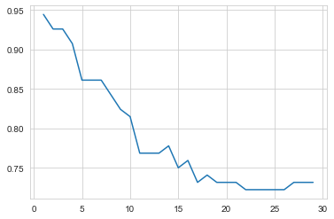

```python
import numpy as np
import matplotlib.pyplot as plt
import scipy.optimize as spo
import pandas as pd
import seaborn as sns
```


```python
url="https://raw.githubusercontent.com/PedroGonzalezBeermann2020/R/main/CafesFincasTMod.csv"
url="https://raw.githubusercontent.com/PedroGonzalezBeermann2020/R/main/KNNDatos.csv"
df=pd.read_csv(url)


d=(np.max(df["Puntaje"])-np.min(df["Puntaje"]))/4
d1=np.min(df["Puntaje"])+d
d2=np.min(df["Puntaje"])+d*2
d3=np.min(df["Puntaje"])+d*3
ranges = [0, d1, d2, d3, float('inf')]          
labels=["Nivel1","Nivel2","Nivel3","Nivel4"]         
df['Category'] = pd.cut(df['Puntaje'], bins=ranges, labels=labels, right=False)


X=df.drop("Puntaje",axis=1)
X=X.drop("Category",axis=1)
X=X.values
y=df["Category"]
y=y.values
y
```


    ['Nivel1', 'Nivel4', 'Nivel4', 'Nivel4', 'Nivel1', ..., 'Nivel1', 'Nivel4', 'Nivel2', 'Nivel1', 'Nivel2']
    Length: 108
    Categories (4, object): ['Nivel1' < 'Nivel2' < 'Nivel3' < 'Nivel4']


```python
from sklearn.preprocessing import StandardScaler
from sklearn.model_selection import train_test_split
from sklearn.neighbors import KNeighborsClassifier
from sklearn.metrics import accuracy_score

X_train, X_test, y_train, y_test = train_test_split(X, y, test_size=0.2)

# Scale the features using StandardScaler
scaler = StandardScaler()
X_train = scaler.fit_transform(X_train)
X_test = scaler.transform(X_test)

knn = KNeighborsClassifier(n_neighbors=3)
knn.fit(X_train, y_train)

y_pred = knn.predict(X_test)
print(y_test)
print(y_pred)
accuracy = accuracy_score(y_test, y_pred)
print("Accuracy:", accuracy)
```

    ['Nivel4', 'Nivel4', 'Nivel1', 'Nivel2', 'Nivel4', ..., 'Nivel1', 'Nivel2', 'Nivel4', 'Nivel4', 'Nivel4']
    Length: 22
    Categories (4, object): ['Nivel1' < 'Nivel2' < 'Nivel3' < 'Nivel4']
    ['Nivel4' 'Nivel4' 'Nivel1' 'Nivel2' 'Nivel4' 'Nivel4' 'Nivel1' 'Nivel4'
     'Nivel4' 'Nivel4' 'Nivel4' 'Nivel4' 'Nivel1' 'Nivel4' 'Nivel4' 'Nivel3'
     'Nivel4' 'Nivel1' 'Nivel2' 'Nivel4' 'Nivel4' 'Nivel4']
    Accuracy: 1.0
    


```python
from sklearn.model_selection import cross_val_score

k_values = [i for i in range (1,30)]
scores = []

scaler = StandardScaler()
X = scaler.fit_transform(X)

for k in k_values:
    knn = KNeighborsClassifier(n_neighbors=k)
    score = cross_val_score(knn, X, y, cv=3)
    scores.append(np.mean(score))
plt.plot(k_values,scores)
```


    [<matplotlib.lines.Line2D at 0x29ee6a8d970>]


    

    


```python
groups = data['trat']  # Reemplaza 'Grupo' con el nombre de la columna que contiene las categorías.
values = data['nivel']  # Reemplaza 'Valor' con el nombre de la columna que contiene la variable dependiente.

f_statistic, p_value = stats.f_oneway(*[values[groups == group] for group in groups.unique()])
```


```python
print(p_value)
```

    0.012096308849364077
    


```python
print(f_statistic)
```

    6.814137994430611
    


```python
import statsmodels.api as sm
import statsmodels.formula.api as smf

```


```python
dat = sm.datasets.get_rdataset("Guerry", "HistData").data
```


```python
results = smf.ols('Lottery ~ Literacy + np.log(Pop1831)', data=dat).fit()
print(results.summary())
```

                                OLS Regression Results                            
    ==============================================================================
    Dep. Variable:                Lottery   R-squared:                       0.348
    Model:                            OLS   Adj. R-squared:                  0.333
    Method:                 Least Squares   F-statistic:                     22.20
    Date:                Tue, 31 Oct 2023   Prob (F-statistic):           1.90e-08
    Time:                        18:18:54   Log-Likelihood:                -379.82
    No. Observations:                  86   AIC:                             765.6
    Df Residuals:                      83   BIC:                             773.0
    Df Model:                           2                                         
    Covariance Type:            nonrobust                                         
    ===================================================================================
                          coef    std err          t      P>|t|      [0.025      0.975]
    -----------------------------------------------------------------------------------
    Intercept         246.4341     35.233      6.995      0.000     176.358     316.510
    Literacy           -0.4889      0.128     -3.832      0.000      -0.743      -0.235
    np.log(Pop1831)   -31.3114      5.977     -5.239      0.000     -43.199     -19.424
    ==============================================================================
    Omnibus:                        3.713   Durbin-Watson:                   2.019
    Prob(Omnibus):                  0.156   Jarque-Bera (JB):                3.394
    Skew:                          -0.487   Prob(JB):                        0.183
    Kurtosis:                       3.003   Cond. No.                         702.
    ==============================================================================
    
    Notes:
    [1] Standard Errors assume that the covariance matrix of the errors is correctly specified.
    


```python
dat
```


<div>
<style scoped>
    .dataframe tbody tr th:only-of-type {
        vertical-align: middle;
    }

    .dataframe tbody tr th {
        vertical-align: top;
    }

    .dataframe thead th {
        text-align: right;
    }
</style>
<table border="1" class="dataframe">
  <thead>
    <tr style="text-align: right;">
      <th></th>
      <th>dept</th>
      <th>Region</th>
      <th>Department</th>
      <th>Crime_pers</th>
      <th>Crime_prop</th>
      <th>Literacy</th>
      <th>Donations</th>
      <th>Infants</th>
      <th>Suicides</th>
      <th>MainCity</th>
      <th>...</th>
      <th>Crime_parents</th>
      <th>Infanticide</th>
      <th>Donation_clergy</th>
      <th>Lottery</th>
      <th>Desertion</th>
      <th>Instruction</th>
      <th>Prostitutes</th>
      <th>Distance</th>
      <th>Area</th>
      <th>Pop1831</th>
    </tr>
  </thead>
  <tbody>
    <tr>
      <th>0</th>
      <td>1</td>
      <td>E</td>
      <td>Ain</td>
      <td>28870</td>
      <td>15890</td>
      <td>37</td>
      <td>5098</td>
      <td>33120</td>
      <td>35039</td>
      <td>2:Med</td>
      <td>...</td>
      <td>71</td>
      <td>60</td>
      <td>69</td>
      <td>41</td>
      <td>55</td>
      <td>46</td>
      <td>13</td>
      <td>218.372</td>
      <td>5762</td>
      <td>346.03</td>
    </tr>
    <tr>
      <th>1</th>
      <td>2</td>
      <td>N</td>
      <td>Aisne</td>
      <td>26226</td>
      <td>5521</td>
      <td>51</td>
      <td>8901</td>
      <td>14572</td>
      <td>12831</td>
      <td>2:Med</td>
      <td>...</td>
      <td>4</td>
      <td>82</td>
      <td>36</td>
      <td>38</td>
      <td>82</td>
      <td>24</td>
      <td>327</td>
      <td>65.945</td>
      <td>7369</td>
      <td>513.00</td>
    </tr>
    <tr>
      <th>2</th>
      <td>3</td>
      <td>C</td>
      <td>Allier</td>
      <td>26747</td>
      <td>7925</td>
      <td>13</td>
      <td>10973</td>
      <td>17044</td>
      <td>114121</td>
      <td>2:Med</td>
      <td>...</td>
      <td>46</td>
      <td>42</td>
      <td>76</td>
      <td>66</td>
      <td>16</td>
      <td>85</td>
      <td>34</td>
      <td>161.927</td>
      <td>7340</td>
      <td>298.26</td>
    </tr>
    <tr>
      <th>3</th>
      <td>4</td>
      <td>E</td>
      <td>Basses-Alpes</td>
      <td>12935</td>
      <td>7289</td>
      <td>46</td>
      <td>2733</td>
      <td>23018</td>
      <td>14238</td>
      <td>1:Sm</td>
      <td>...</td>
      <td>70</td>
      <td>12</td>
      <td>37</td>
      <td>80</td>
      <td>32</td>
      <td>29</td>
      <td>2</td>
      <td>351.399</td>
      <td>6925</td>
      <td>155.90</td>
    </tr>
    <tr>
      <th>4</th>
      <td>5</td>
      <td>E</td>
      <td>Hautes-Alpes</td>
      <td>17488</td>
      <td>8174</td>
      <td>69</td>
      <td>6962</td>
      <td>23076</td>
      <td>16171</td>
      <td>1:Sm</td>
      <td>...</td>
      <td>22</td>
      <td>23</td>
      <td>64</td>
      <td>79</td>
      <td>35</td>
      <td>7</td>
      <td>1</td>
      <td>320.280</td>
      <td>5549</td>
      <td>129.10</td>
    </tr>
    <tr>
      <th>...</th>
      <td>...</td>
      <td>...</td>
      <td>...</td>
      <td>...</td>
      <td>...</td>
      <td>...</td>
      <td>...</td>
      <td>...</td>
      <td>...</td>
      <td>...</td>
      <td>...</td>
      <td>...</td>
      <td>...</td>
      <td>...</td>
      <td>...</td>
      <td>...</td>
      <td>...</td>
      <td>...</td>
      <td>...</td>
      <td>...</td>
      <td>...</td>
    </tr>
    <tr>
      <th>81</th>
      <td>86</td>
      <td>W</td>
      <td>Vienne</td>
      <td>15010</td>
      <td>4710</td>
      <td>25</td>
      <td>8922</td>
      <td>35224</td>
      <td>21851</td>
      <td>2:Med</td>
      <td>...</td>
      <td>20</td>
      <td>1</td>
      <td>44</td>
      <td>40</td>
      <td>38</td>
      <td>65</td>
      <td>18</td>
      <td>170.523</td>
      <td>6990</td>
      <td>282.73</td>
    </tr>
    <tr>
      <th>82</th>
      <td>87</td>
      <td>C</td>
      <td>Haute-Vienne</td>
      <td>16256</td>
      <td>6402</td>
      <td>13</td>
      <td>13817</td>
      <td>19940</td>
      <td>33497</td>
      <td>2:Med</td>
      <td>...</td>
      <td>68</td>
      <td>6</td>
      <td>78</td>
      <td>55</td>
      <td>11</td>
      <td>84</td>
      <td>7</td>
      <td>198.874</td>
      <td>5520</td>
      <td>285.13</td>
    </tr>
    <tr>
      <th>83</th>
      <td>88</td>
      <td>E</td>
      <td>Vosges</td>
      <td>18835</td>
      <td>9044</td>
      <td>62</td>
      <td>4040</td>
      <td>14978</td>
      <td>33029</td>
      <td>2:Med</td>
      <td>...</td>
      <td>58</td>
      <td>34</td>
      <td>5</td>
      <td>14</td>
      <td>85</td>
      <td>11</td>
      <td>43</td>
      <td>174.477</td>
      <td>5874</td>
      <td>397.99</td>
    </tr>
    <tr>
      <th>84</th>
      <td>89</td>
      <td>C</td>
      <td>Yonne</td>
      <td>18006</td>
      <td>6516</td>
      <td>47</td>
      <td>4276</td>
      <td>16616</td>
      <td>12789</td>
      <td>2:Med</td>
      <td>...</td>
      <td>32</td>
      <td>22</td>
      <td>35</td>
      <td>51</td>
      <td>66</td>
      <td>27</td>
      <td>272</td>
      <td>81.797</td>
      <td>7427</td>
      <td>352.49</td>
    </tr>
    <tr>
      <th>85</th>
      <td>200</td>
      <td>NaN</td>
      <td>Corse</td>
      <td>2199</td>
      <td>4589</td>
      <td>49</td>
      <td>37015</td>
      <td>24743</td>
      <td>37016</td>
      <td>2:Med</td>
      <td>...</td>
      <td>81</td>
      <td>2</td>
      <td>84</td>
      <td>83</td>
      <td>9</td>
      <td>25</td>
      <td>1</td>
      <td>539.213</td>
      <td>8680</td>
      <td>195.41</td>
    </tr>
  </tbody>
</table>
<p>86 rows × 23 columns</p>
</div>


```python

```
